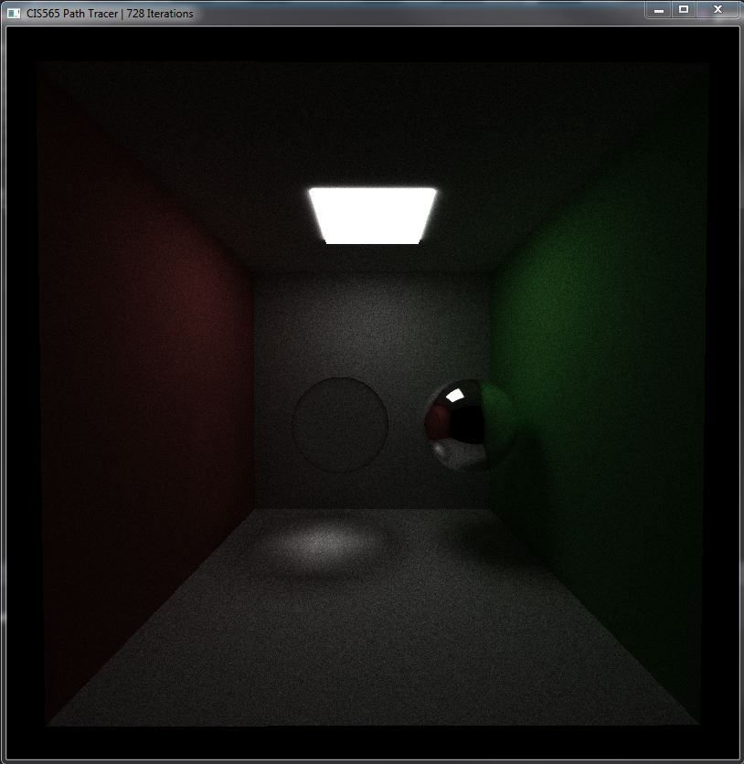
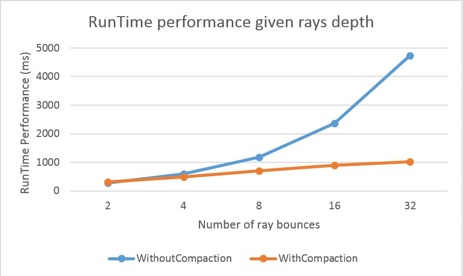
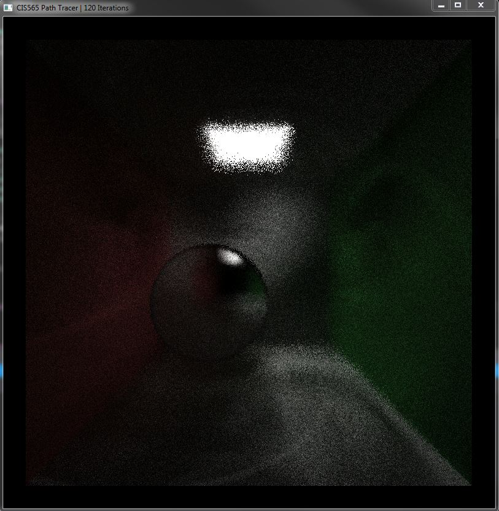
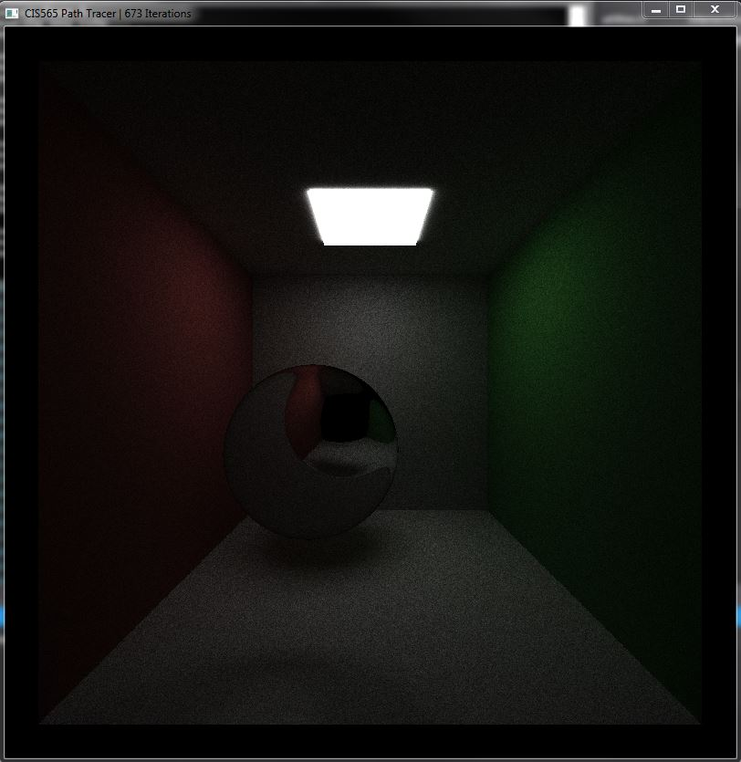

# University of Pennsylvania, CIS 565: GPU Programming and Architecture.
Project 3 CUDA: Path Tracer
====================

## User resources
- **Name:** David Grosman.
- **Tested on:** Microsoft Windows 7 Professional, i7-5600U @ 2.6GHz, 256GB, GeForce 840M (Personal laptop).

## Project description
This Project's purpose was to gain some experience with writing Graphics code that would benefit as much as possible from CUDA as possible. In fact, a path tracer is a very useful type of application to run on Cuda since each ray processed by the application can be done in a separate thread. Furthermore, computations such as intersection-testing and pixel coloring are very intensive and are thus most usefully done on GPU. Furthermore, there is no memory bandwidth from CPU to GPU to pass on the pixel buffer as is usually the case in a CPU implementation.
In this project, I have implemented several key features such as:

1. Diffuse shading
2. Specular reflection and refraction.
3. Caching Initial rays.
4. Stream compaction on non-terminated paths during each iteration.
5. Sort Rays by material type they are intersecting with.
6. Depth of Field.
7. Better hemisphere sampling methods.

###Shading: Diffuse and Specular reflection, refraction. 
The shading implemented for this project is pretty straight-forward and is inspired from http://graphics.stanford.edu/courses/cs148-10-summer/docs/2006--degreve--reflection_refraction.pdf. The reflectance factor used to determine how much of the reflecting vs. refracting ray to use for the final color was implemented using the Schlik's approximation, which is pretty Schlik. The ray used to determine the diffuse color is actually a cosine weighted  hemisphere where there are fewer rays along the horizon and increase density as we go up.

###Caching Initial rays.
Since all initial rays go from the camera's position to each pixel of the screen, it is easy to cache the first intersection of each ray since they stay constant until the camera (or scene objects) move again. Unfortunately, there isn't much performance gain from doing this since we must not only use a lot of memory to store the intersections but we also only use them for the first ray bounce which is often a small portion of the time the path-tracer determines new intersections since each ray must bounce at least 8 times to get nice global illumination effects.

###Stream compaction on non-terminated paths.
As shown on the graph below, the performance increase in compacting non-terminated paths is non-negligent, especially when increasing the number of bounces per ray. This is the most important optimization done for this project.

###Sort Rays by material type they are intersecting with.
This is an optimization which actually decreased the performance of the application: The time spent sorting the rays is non-negligeable, especially when there are so many rays and not space or time-coherent scheme is adopted to sort the rays faster. This optimization should be tested on Waverfont pathtracing where rays are grouped by material without a sorting pass.

###Depth of Field.
Depth of field is an easy technique to implement when ray-tracing since the only change is how rays are generated. In fact their origin should be located on the lens and their direction should be towards a point that is at a dustance specified by the focal distance.

###Better hemisphere sampling methods.
I implemented Jittered, Halton and Sobel Pseudo-Random generators to improve the cosine weighted hemisphere generated when computing the diffuse component. Quasi-Random numbers as generated by Halton and Sobel schemes is pretty powerful since they can issue sequences of numbers specifically designed to fill an interval (typically [0…1] in n-dimensional space) in a relatively uniform way (compared to purely random or pseudo-random). In fact, each new number (or vector) in the sequence is spaced as far as possible from the previous ones. Their goal is to be able to generate randomized, but relatively uniformly spaced patterns, similar to jittering, but not requiring knowledge ahead of time about the total number of samples.

